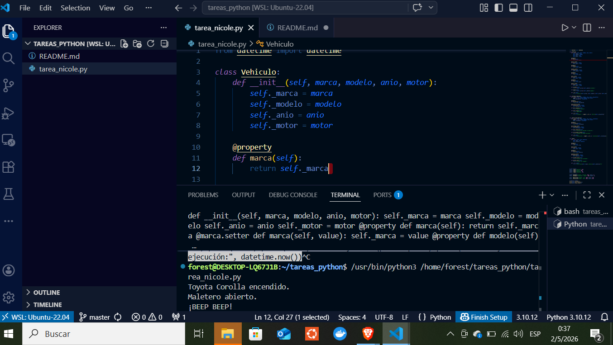

# Explicación del Sistema de Vehículos en Python

## 1. Visión general
Este programa implementa un modelo
 **vehículos** utilizando Programación Orientada a Objetos (POO). Se aplican conceptos clave como:
- **Encapsulación** (Es el uso de atributos privados y propiedades).
- **Herencia** (Son las clases derivadas que reutilizan comportamiento).
- **Composición** (un vehículo tiene un motor).

El objetivo es representar distintos tipos de vehículos (automóviles y motocicletas) junto con sus características y comportamientos.

---

## 2. Clase base: Vehículo
La clase "Vehiculo" es la base del sistema. Define las características comunes que tendrán todos los vehículos.

### Atributos
- Marca
- Modelo
- Año
- Motor (objeto de otra clase)

Estos atributos se definen como **privados** (con guion `_`) para protegerlos y evitar acceso directo.

### Propiedades (getters y setters)
Se utilizan decoradores como `@property` para:
- Obtener el valor de los atributos.
- Modificarlos de forma controlada.

Esto permite aplicar validaciones en el futuro sin cambiar el resto del código.

### Métodos
- **encender()**: devuelve un mensaje indicando que el vehículo está encendido.
- **apagar()**: devuelve un mensaje indicando que el vehículo está apagado.
- **__str__()**: permite mostrar el objeto como texto legible.

---

## 3. Clase Automóvil
Es una clase derivada de `Vehiculo`, lo que significa que **hereda** todos sus atributos y métodos.

### Característica adicional
- Número de puertas

### Métodos propios
- **abrir_maletero()**: simula abrir el maletero.
- **tocar_claxon()**: simula el sonido del claxon.

### Sobrescritura de método
- Redefine `__str__()` para incluir:
  - Información del vehículo base
  - Número de puertas

Esto es un ejemplo de **polimorfismo**, ya que cambia el comportamiento de un método heredado.

---

## 4. Clase Motocicleta
También hereda de `Vehiculo`, pero representa otro tipo de transporte.

### Característica adicional
- Cilindraje (capacidad del motor)

### Métodos propios
- **hacer_caballito()**: acción típica de motocicletas.
- **usar_patada_arranque()**: simula el arranque manual.

### Sobrescritura
- Redefine `__str__()` para incluir el cilindraje.

---

## 5. Clase Motor
Esta clase representa el motor de un vehículo.

### Atributos
- Tipo (gasolina, diésel, eléctrico)
- Potencia (en caballos de fuerza)

### Métodos
- **encender_motor()** y **detener_motor()**: simulan su funcionamiento.
- **__str__()**: permite mostrar la información del motor como texto.

### Relación importante
Aquí se aplica **composición**, ya que:
- Un vehículo *tiene un* motor
- El motor es un objeto independiente que se pasa al vehículo

---

## 6. Creación de objetos
Se crean:
- Varios motores con diferentes características
- Vehículos (automóviles y motocicletas) que usan esos motores

Esto demuestra cómo se pueden reutilizar objetos dentro de otros.

---

## 7. Ejecución de métodos
El programa llama a distintos métodos para simular acciones:
- Encender vehículos
- Usar funciones específicas (maletero, claxon, caballito, etc.)

Esto muestra el comportamiento dinámico de cada tipo de objeto.

---

## 8. Impresión de objetos
Se imprimen los vehículos usando `print()`.

Gracias al método `__str__()`:
- La salida es clara y entendible
- Se muestra información completa del vehículo y su motor

---

## 9. Fecha y hora
Se utiliza `datetime.now()` para mostrar el momento exacto de ejecución del programa.

---

## 10. Conclusión
Este programa demuestra correctamente varios pilares de la POO:
- Reutilización de código mediante herencia
- Protección de datos con encapsulación
- Flexibilidad mediante polimorfismo
- Relación entre objetos usando composición

Es una base sólida para sistemas más complejos como:
- Gestión de vehículos
- Simuladores
- Sistemas de concesionarios

